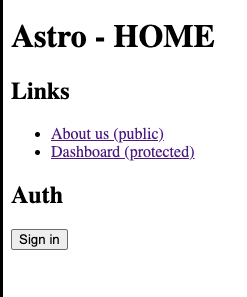
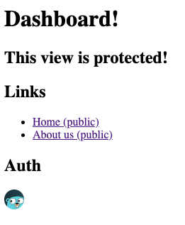

# Astro Clerk




## Dependencies

- pnpm create astro@latest `Astro Starter Kit: Minimal`
- pnpm astro add vercel
- pnpm add @clerk/astro

## Deploy

[](https://vercel.com/new/clone?repository-url=https%3A%2F%2Fgithub.com%2Fromelgomez%2Fastro-clerk&env=PUBLIC_CLERK_PUBLISHABLE_KEY,CLERK_SECRET_KEY&envDescription=Clerk%20API%20keys&envLink=https%3A%2F%2Fclerk.com%2Fdocs%2Fquickstart%2Fastro&redirect-url=https%3A%2F%2Fclerk.com%2Fdocs%2Fquickstart%2Fastro)


## Running the template

```bash
git clone https://github.com/romelgomez/astro-clerk
```
